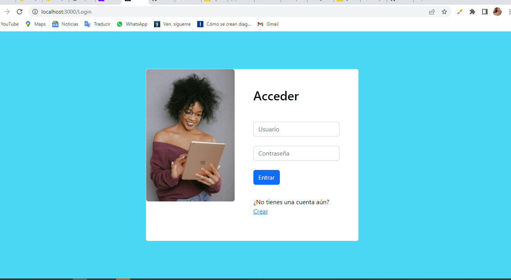
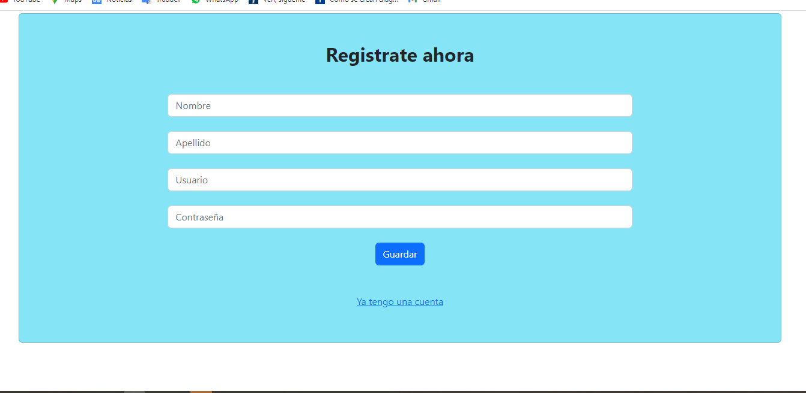
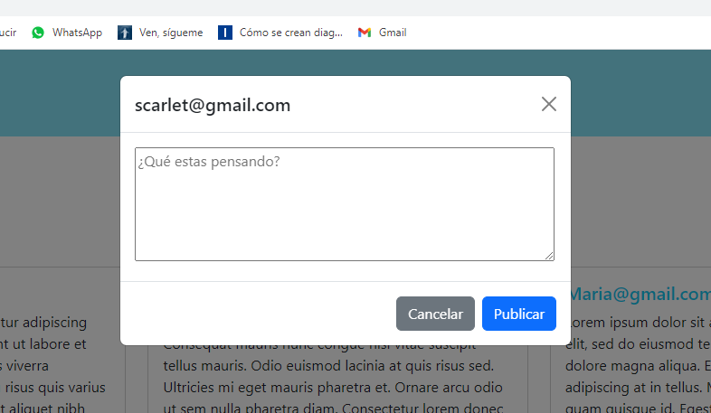
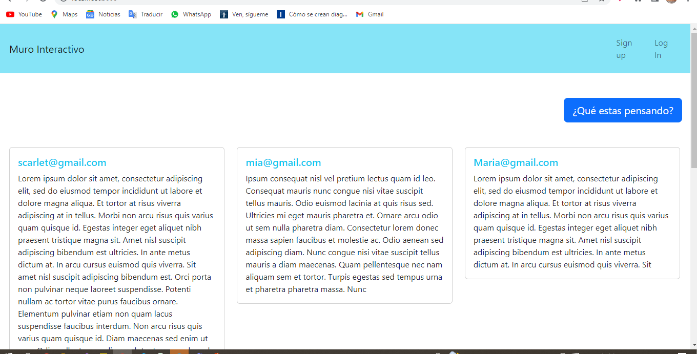

Proyecto Final

Muro Interactivo
Haga un sistema WEB que permita a los visitantes las siguientes funcionalidades:
1. Ver todas las publicaciones hechas por todos los usuarios (No requiere autenticación)
2. Crear una cuenta de usuario (del usuario se guardará: usuario, clave nombre, apellido)
3. Iniciar Sesión
4. Publicar nuevos posts (Solo usuarios autenticados)

Johanny Tavarez 2020-10554

Descripcion del proyecto

Este proyecto permite realizar post en un muro interactivo, cuando se pulsa el boton de "¿Qué estas pensando", abre uuna ventana modal donde se ve el email del usuario logueado, si no hay nadie logueado la pagina se autodirige al login.

Una persona aunque no este logueada puede ver todos los post realizados. Estos post se almacenan en forma de carta y estan distribuidos en columnas, su tamaño se adapta conforme al texto publicado. 

un usuario se desloguea al pulsar el boton de login o de sign up. 
